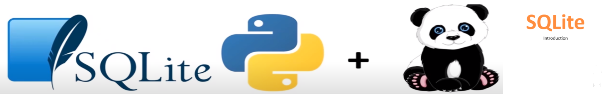

# Sqlite Introduction - SQLite introduction provides an introduction to SQL lite
##  SQLite Introduction Solution Overview


Here’s a **README.md** for the **SQLite_introduction.ipynb** that introduces how to install, configure, and use SQLite:

---

# Introduction to SQLite

This project demonstrates the basics of **SQLite** through the Jupyter Notebook `SQLite_introduction.ipynb`. **SQLite** is a lightweight, embedded **relational database management system (RDBMS)** that is widely used for smaller-scale applications, mobile apps, and embedded systems. This notebook will walk you through installing, configuring, and working with SQLite, along with example code in **Python**.

## Table of Contents
- [Introduction](#introduction)
- [Features of SQLite](#features-of-sqlite)
- [Installation](#installation)
- [Usage](#usage)
- [Python and SQLite](#python-and-sqlite)
- [Conclusion](#conclusion)

## Introduction

SQLite is a powerful yet **lightweight** database engine that doesn't require a server to operate. It stores all data in a **single disk file** and is designed to be **self-contained** and **efficient** with minimal configuration. SQLite is widely used in **mobile applications**, **embedded systems**, and **small-scale projects** due to its simplicity and reliability. In this notebook, you will learn how to use SQLite, particularly in Python, where the `sqlite3` module comes **built-in**.

## Features of SQLite

- **Lightweight and Embedded**: SQLite is small and operates without requiring a separate database server. All data is stored in a single file on disk.
- **Minimal Configuration**: Since SQLite is embedded, it requires almost no configuration to get started.
- **Widely Used**: It is popular in mobile apps, embedded systems, and small-scale projects where efficiency and simplicity are required.
- **Free and Open-Source**: SQLite is freely available under a permissive license, making it a popular choice for many software applications.
- **Self-contained and Serverless**: Unlike other RDBMS, SQLite is serverless, which simplifies its setup and use.
- **SQL Support**: Despite being lightweight, SQLite fully supports **standard SQL** for managing relational databases.

## Installation

To begin using SQLite, no installation is necessary if you're working in Python, as the **sqlite3** module is included in Python's standard library. However, if you'd like to install SQLite on your system for direct interaction, follow these steps:

1. **For Windows**:
   - Download the SQLite tools from the [SQLite Downloads page](https://www.sqlite.org/download.html).
   - Unzip the files and add the path to your system environment variables.

2. **For Mac/Linux**:
   - SQLite is often pre-installed on macOS and Linux systems. To check:
     ```bash
     sqlite3 --version
     ```
   - If it's not installed, you can install it via Homebrew (for macOS) or APT (for Linux):
     ```bash
     brew install sqlite3   # macOS
     sudo apt-get install sqlite3   # Linux
     ```

## Usage

Once SQLite is installed or accessed via Python, you can use it by following these basic steps:

1. **Creating a Database**:
   - SQLite operates on a single file that stores your entire database. Create a new database by connecting to a new or existing file:

     
   
2. **Basic SQL Commands**:
   - You can create tables, insert data, and run queries using standard SQL commands:

3. **Closing the Database**:
   - To exit the SQLite environment:

## Python and SQLite

Python provides built-in support for SQLite using the `sqlite3` module, allowing you to easily work with SQLite databases within Python scripts or Jupyter notebooks. Here's an example:

### Example in Python:

```python
import sqlite3

# Connect to SQLite database (or create it if it doesn't exist)
conn = sqlite3.connect('my_database.db')

# Create a cursor object
cur = conn.cursor()

# Create a table

## Getting Started

The goal of this solution is to **Jump Start** your development and have you up and running in 30 minutes. 

To get started with the **Sqlite Introduction** solution repository, follow these steps:
1. Clone the repository to your local machine.
2. Install the required dependencies listed at the top of the notebook.
3. Explore the example code provided in the repository and experiment.
4. Run the notebook and make it your own - **EASY !**
    
## Solution Features
- Easy to understand and use  
- Easily Configurable 
- Quickly start your project with pre-built templates
- Its Fast and Automated

## Notebook Features

These Features are design to provide everything you need for **Knowledge Transfer** 

- **Self Documenting** - Automatically identifes major steps in notebook 
- **Self Testing** - Unit Testing for each function
- **Easily Configurable** - Easily modify with **config.INI** - keyname value pairs
- **Includes Talking Code** - The code explains itself 
- **Self Logging** - Enhanced python standard logging   
- **Self Debugging** - Enhanced python standard debugging
- **Low Code** - or - No Code  - Most solutions are under 50 lines of code
- **Educational** - Includes educational dialogue and background material
    
## List of Figures
   <br>
    

## Github https://github.com/JoeEberle/ - Email  josepheberle@outlook.com 
    


    